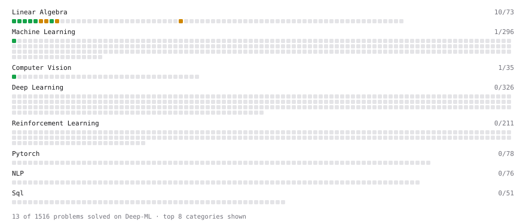

# Deep-ML

My machine learning practice from [Deep-ML](https://www.deep-ml.com). Every solution here was written by hand.

**21** solved · 21 problems · 0 labs · 0 math

[**Browse the interactive portfolio**](https://vaishnavgutlapalli46-jpg.github.io/deep-ml/) to replay this filling in over time.

## Problems

| | Difficulty | Solved | |
| --- | --- | --- | --- |
| [Calculate 2x2 Matrix Inverse](https://www.deep-ml.com/problems/8) | easy | 2026-10-04 | [solution](problems/0008-calculate-2x2-matrix-inverse) |
| [Calculate Image Brightness](https://www.deep-ml.com/problems/70) | easy | 2026-10-02 | [solution](problems/0070-calculate-image-brightness) |
| [Calculate Mean by Row or Column](https://www.deep-ml.com/problems/4) | easy | 2026-10-02 | [solution](problems/0004-calculate-mean-by-row-or-column) |
| [Check Linear Independence of Vectors](https://www.deep-ml.com/problems/331) | easy | 2026-10-08 | [solution](problems/0331-check-linear-independence-of-vectors) |
| [Convert Vector to Diagonal Matrix](https://www.deep-ml.com/problems/35) | easy | 2026-10-06 | [solution](problems/0035-convert-vector-to-diagonal-matrix) |
| [Derivative of a Polynomial](https://www.deep-ml.com/problems/116) | easy | 2026-09-29 | [solution](problems/0116-derivative-of-a-polynomial) |
| [Dot Product Calculator](https://www.deep-ml.com/problems/83) | easy | 2026-10-06 | [solution](problems/0083-dot-product-calculator) |
| [Linear Regression Using Normal Equation](https://www.deep-ml.com/problems/14) | easy | 2026-10-03 | [solution](problems/0014-linear-regression-using-normal-equation) |
| [Matrix Determinant & Trace](https://www.deep-ml.com/problems/195) | easy | 2026-10-07 | [solution](problems/0195-matrix-determinant-trace) |
| [Matrix-Vector Dot Product](https://www.deep-ml.com/problems/1) | easy | 2026-10-03 | [solution](problems/0001-matrix-vector-dot-product) |
| [Reshape Matrix](https://www.deep-ml.com/problems/3) | easy | 2026-10-02 | [solution](problems/0003-reshape-matrix) |
| [Scalar Multiplication of a Matrix](https://www.deep-ml.com/problems/5) | easy | 2026-10-01 | [solution](problems/0005-scalar-multiplication-of-a-matrix) |
| [Transformation Matrix from Basis B to C](https://www.deep-ml.com/problems/27) | easy | 2026-10-08 | [solution](problems/0027-transformation-matrix-from-basis-b-to-c) |
| [Transpose of a Matrix](https://www.deep-ml.com/problems/2) | easy | 2026-10-02 | [solution](problems/0002-transpose-of-a-matrix) |
| [Vector Element-wise Sum](https://www.deep-ml.com/problems/121) | easy | 2026-10-06 | [solution](problems/0121-vector-element-wise-sum) |
| [2D Translation Matrix Implementation](https://www.deep-ml.com/problems/55) | medium | 2026-10-09 | [solution](problems/0055-2d-translation-matrix-implementation) |
| [Calculate Eigenvalues of a Matrix](https://www.deep-ml.com/problems/6) | medium | 2026-10-01 | [solution](problems/0006-calculate-eigenvalues-of-a-matrix) |
| [Matrix Rank](https://www.deep-ml.com/problems/329) | medium | 2026-10-08 | [solution](problems/0329-matrix-rank) |
| [Matrix times Matrix ](https://www.deep-ml.com/problems/9) | medium | 2026-10-05 | [solution](problems/0009-matrix-times-matrix) |
| [Matrix Transformation ](https://www.deep-ml.com/problems/7) | medium | 2026-10-04 | [solution](problems/0007-matrix-transformation) |
| [Solve System of Linear Equations Using Cramer's Rule](https://www.deep-ml.com/problems/119) | medium | 2026-10-02 | [solution](problems/0119-solve-system-of-linear-equations-using-cramer-s-rule) |

---

_This file is regenerated by Deep-ML on every push._
